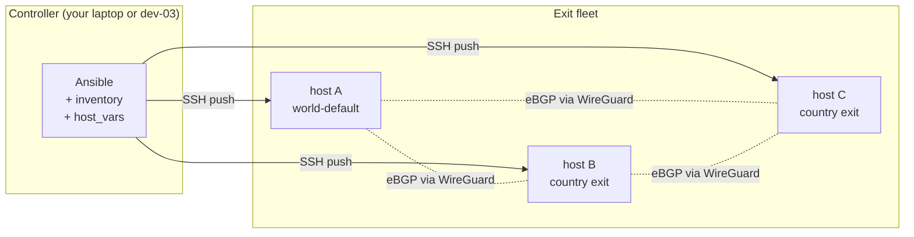
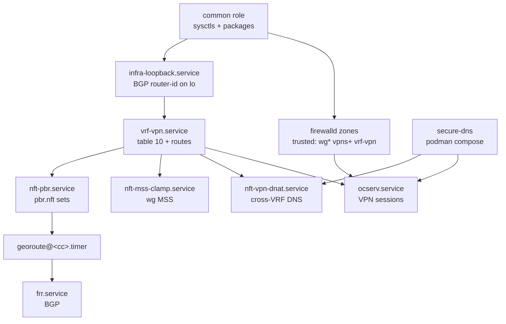

# 00 — How it all fits together

A standalone walkthrough that ties every component to the others and shows
the actual files you edit to make it work. Read this **before** the
per-section docs.

## The 60-second pitch

You run **N hosts** in different countries. One of them is the "world
default" exit. The others each own one country's traffic. A VPN client
connects to any of them and gets:

- destinations in country `XX` → exit through the host **physically located
  in `XX`**;
- everything else → exit through the world-default host.

If the country's host dies, traffic for that country falls back to the
world-default host. No client config change needed.

The repository deploys this with **Ansible only**. No manual SSH on the
hosts after the first `ansible-playbook` run.

## What goes where — at a glance



Three layers, each owned by a different piece:

| Layer            | Owner          | What it does                                                   | Config you touch                    |
|------------------|----------------|----------------------------------------------------------------|-------------------------------------|
| Data plane       | Linux kernel   | actually forwards packets                                      | none — driven by the other two       |
| Control plane    | FRR + georoute | tells the kernel which destination goes where                  | `host_vars/dev-NN.yml` `country:` block + manual `frr.conf` neighbors |
| Configuration    | Ansible        | renders templates, restarts services, reloads `occtl`          | `inventory/`, `playbooks/site.yml`  |

## Worked example — RU exit + FI world default

Two physical hosts. The example uses **RFC 5737** (`192.0.2.0/24`,
`198.51.100.0/24`) IPv4 and **RFC 3849** (`2001:db8::/32`) IPv6 — replace
with your real provider addresses.

### 1. Allocate identifiers

| | host A (dev-03) | host B (dev-04) |
|---|---|---|
| Role            | world-default exit (Finland)        | country exit (Russia)               |
| Public v4       | `192.0.2.3`                         | `198.51.100.4`                      |
| Public v6       | `2001:db8:fi::2`                    | `2001:db8:ru::2`                    |
| `site_octet`    | `3`                                 | `4`                                 |
| Private ASN     | `64512` (legacy)                    | `4200000004`                        |
| VPN v4 pool     | `100.64.3.0/24` (CGNAT)             | `100.64.4.0/24`                     |
| VPN v6 pool     | `fdf3:bb42:9fc6:3::/64` (ULA)       | `fdf3:bb42:9fc6:4::/64`             |
| BGP router-id   | `10.255.0.3`                        | `10.255.0.4`                        |
| WG iface name   | `wg102`                             | `wg0`                               |
| WG /31 link     | `169.254.255.0` ↔ `169.254.255.1`   | same                                |
| Country tag     | (none — it's the default exit)      | `64512:201` (legacy RU community)   |
| `fwmark`        | (none)                              | `0x201`                             |
| PBR table       | (none)                              | `100`                               |

### 2. Inventory: two files

`inventory/hosts.yml`:

```yaml
all:
  children:
    exits:
      children:
        exits-world:
          hosts:
            dev-03:
              ansible_host: 192.0.2.3
              ansible_connection: local        # if you run Ansible on dev-03
        exits-country-local:
          hosts:
            dev-04:
              ansible_host: 198.51.100.4
              ansible_connection: ssh
```

`inventory/host_vars/dev-03.yml` (the world-default host):

```yaml
site: fi
role: world-default
site_octet: 3
public_v4: 192.0.2.3
public_v6: "2001:db8:fi::2"

# Host uplinks (the actual NIC and gateway from `ip route`)
host_v4_uplink: ens1
host_v4_gw: 192.0.2.1
host_v6_uplink: r64stk         # whatever your v6 uplink is

# VPN clients on this host exit through host's own uplinks
v4_uplink_iface: ens1
v4_uplink_gw: 192.0.2.1
v6_uplink_iface: r64stk
v6_uplink_gw: "2001:db8:fi::1"

# Sibling site for transit-return routes
wg_sibling_iface: wg102                # name of WG iface to dev-04
sibling_v4_pool: 100.64.4.0/24
sibling_v6_pool: "fdf3:bb42:9fc6:4::/64"
wg_sibling_peer_v4: 169.254.255.1      # dev-04 side of the /31
wg_sibling_peer_v6: "fe80::4"

# Pools, BGP, ocserv vhosts (see 04-inventory.md for the full shape)
v4_pool_cidr: 100.64.3.0/24
v6_pool_cidr: "fdf3:bb42:9fc6:3::/64"
bgp_router_id_v4: 10.255.0.3
push_dns_resolvers: ["9.9.9.9", "2606:4700:4700::1111"]
secure_dns_enabled: false
ocserv_vhosts:
  - { name: vpn.example.org, is_default: true, user_profile: default.xml }
```

`inventory/host_vars/dev-04.yml` (the RU country exit):

```yaml
site: ru
role: country-exit
site_octet: 4
public_v4: 198.51.100.4
public_v6: "2001:db8:ru::2"

host_v4_uplink: ens1
host_v4_gw: 198.51.100.1
host_v6_uplink: sit1

# VPN clients on dev-04 exit through wg0 → dev-03 → FI uplink
# (only RU prefixes are overridden by georoute below to exit locally)
v4_uplink_iface: wg0
v4_uplink_gw: 169.254.255.0
v6_uplink_iface: wg0
v6_uplink_gw: "fe80::3"
wg_sibling_iface: wg0
sibling_v4_pool: 100.64.3.0/24
sibling_v6_pool: "fdf3:bb42:9fc6:3::/64"
wg_sibling_peer_v4: 169.254.255.0
wg_sibling_peer_v6: "fe80::3"

v4_pool_cidr: 100.64.4.0/24
v6_pool_cidr: "fdf3:bb42:9fc6:4::/64"
bgp_router_id_v4: 10.255.0.4
push_dns_resolvers: ["9.9.9.9", "2606:4700:4700::1111"]
secure_dns_enabled: false

# ☆ The country block — this is what makes dev-04 a country exit
country:
  iso2: RU
  iso_numeric: 643
  bgp_community: "64512:201"
  route_map: MARK-RU-EXIT
  nft_set_prefix: ru
  feed_url: "https://stat.ripe.net/data/country-resource-list/data.json?resource=RU&v4_format=prefix"
  fwmark: "0x201"
  pbr_table: 100
```

### 3. WireGuard tunnel — created manually once

WireGuard between dev-03 and dev-04 is not yet templated; create it
out-of-band:

```bash
# both hosts:
dnf install -y wireguard-tools
umask 077
wg genkey | tee /etc/wireguard/${IFACE}.key | wg pubkey > /etc/wireguard/${IFACE}.pub
wg genpsk > /etc/wireguard/${IFACE}.psk
```

dev-03 → `/etc/wireguard/wg102.conf`:

```ini
[Interface]
Address = 169.254.255.0/31
Address = fdf3:bb42:9fc6:ffff::2/127
PrivateKey = <dev-03 private key>
ListenPort = 31518
Table = off

[Peer]
PublicKey = <dev-04 public key>
PresharedKey = <shared psk>
AllowedIPs = 0.0.0.0/0, ::/0
Endpoint = 198.51.100.4:31518
PersistentKeepalive = 25
```

dev-04 → `/etc/wireguard/wg0.conf` is the mirror image with addresses
`169.254.255.1/31` + `fdf3:bb42:9fc6:ffff::3/127`, `Endpoint =
192.0.2.3:31518`, and the opposite `PublicKey`/`PresharedKey`.

Bring both up:

```bash
systemctl enable --now wg-quick@wg102          # on dev-03
systemctl enable --now wg-quick@wg0            # on dev-04
ping -c2 169.254.255.1                          # from dev-03 — must succeed
```

### 4. FRR — neighbor sections (manual once, role planned)

In `/etc/frr/frr.conf` on dev-03, inside `router bgp 64512`:

```text
 neighbor 169.254.255.1 remote-as 4200000004
 neighbor 169.254.255.1 description dev-04-ru
 !
 address-family ipv4 unicast
  network 100.64.3.0/24
  network 10.255.0.3/32
  ! BEGIN-RU-FEED-V4
  ! END-RU-FEED-V4
  neighbor 169.254.255.1 activate
  neighbor 169.254.255.1 route-map FROM-DEV-04 in
  neighbor 169.254.255.1 route-map TO-DEV-04 out
 exit-address-family
 !
 address-family ipv6 unicast
  network fdf3:bb42:9fc6:3::/64
  ! BEGIN-RU-FEED-V6
  ! END-RU-FEED-V6
  neighbor fe80::4%wg102 activate
 exit-address-family

bgp community-list standard CL-RU-EXIT seq 5 permit 64512:201
route-map MARK-RU-EXIT permit 10
 set community 64512:201 additive
route-map BGP-MAIN-FIB deny 10
 match community CL-RU-EXIT
route-map BGP-MAIN-FIB permit 999

ip protocol bgp route-map BGP-MAIN-FIB
ipv6 protocol bgp route-map BGP-MAIN-FIB
```

dev-04's `frr.conf` is the mirror — `router bgp 4200000004`, neighbor
`169.254.255.0 remote-as 64512`, same community + route-maps. The
`BEGIN-/END-RU-FEED-V4/V6` markers stay empty until `georoute` populates
them on its first run.

### 5. Apply Ansible

```bash
cd /path/to/polyexit
ansible-playbook playbooks/site.yml --check --diff   # dry-run
ansible-playbook playbooks/site.yml                   # apply
```

The playbook will:

| Role         | dev-03                                 | dev-04                                 |
|--------------|----------------------------------------|----------------------------------------|
| `common`     | sysctls + packages                     | sysctls + packages                     |
| `vrf-vpn`    | `vrf-vpn` table 10 with FI defaults    | `vrf-vpn` table 10 with wg0 defaults   |
| `nft-vpn`    | MSS clamp on `wg102`                   | MSS clamp on `wg0`                     |
| `ocserv`     | render `ocserv.conf` + connect-script  | same                                   |
| `georoute`   | (skipped — no `country:` block)        | install binary + `/etc/georoute/ru.env` + start `georoute@ru.timer` |

### 6. First country-prefix fetch

The timer will fire 5 minutes after boot, but trigger it now:

```bash
ssh root@198.51.100.4 systemctl start georoute@ru.service
ssh root@198.51.100.4 journalctl -u georoute@ru.service -n 8 --no-pager
# … georoute[RU] nft sets updated (ru_v4=8621 ru_v6=2186)
# … georoute[RU] frr-reload completed
```

dev-03 learns the RU prefixes via BGP within seconds:

```bash
ssh root@192.0.2.3 vtysh -c 'show bgp ipv4 unicast community 64512:201 | head'
ssh root@192.0.2.3 ip -4 route show table 10 proto bgp | head
```

### 7. Test from a real VPN client

Connect to the published vhost (`vpn.example.org`). From the client:

```bash
curl -4 ifconfig.io                              # → 192.0.2.3 (FI exit)
curl -4 -H 'Host: ifconfig.io' 77.88.55.88       # ya.ru IP — exits Moscow
curl -6 ifconfig.io                              # → host's v6
```

The destination IP determines the exit, automatically.

## Files you touch — the cheat sheet

| You change…                                       | …to…                                                |
|---------------------------------------------------|-----------------------------------------------------|
| `inventory/hosts.yml`                             | add or remove a host from the fleet                 |
| `inventory/host_vars/dev-NN.yml`                  | change per-host values (uplink, pool, country)      |
| `inventory/group_vars/all.yml`                    | fleet-wide values (ocserv tuning, package list)     |
| `inventory/group_vars/vault.yml`                  | secrets (encrypted with `ansible-vault`)            |
| `roles/<role>/templates/*.j2`                     | how a config file is rendered                       |
| `roles/<role>/tasks/main.yml`                     | what the role does and in what order                |
| `playbooks/site.yml`                              | role ordering and conditions                        |
| `/etc/frr/frr.conf` (manual)                      | BGP topology — see [Adding a country exit](07-country-exit-bootstrap.md) |
| `/etc/wireguard/<iface>.conf` (manual)            | inter-site tunnels                                  |

## Files you NEVER touch by hand

| File                                              | Why                                                 |
|---------------------------------------------------|-----------------------------------------------------|
| `/etc/systemd/system/vrf-vpn.service`             | rendered by `roles/vrf-vpn`                         |
| `/etc/ocserv/ocserv.conf`                         | rendered by `roles/ocserv`                          |
| `/etc/ocserv/connect-vrf.sh`                      | rendered by `roles/ocserv`                          |
| `/etc/nft.d/*.nft`                                | rendered by `roles/nft-vpn` and `roles/georoute`    |
| `/etc/georoute/<cc>.env`                          | rendered by `roles/georoute`                        |
| `/etc/frr/frr.conf` content **between** the `BEGIN-<CC>-FEED-{V4,V6}` markers | written by `georoute` on every timer fire |

If you change one of these by hand, the next playbook run will overwrite
your edit. Fix the template instead.

## Component dependency chart



## Minimum to try this on a single laptop

You don't need a fleet. To exercise the data-plane bits:

```bash
# A throwaway VM with OL10/Rocky10/Alma10/RHEL10:
dnf install -y ansible-core git
ansible-galaxy collection install ansible.posix community.general
git clone https://github.com/dantte-lp/polyexit.git
cd polyexit

# Make hosts.yml localhost-only:
cat > inventory/hosts.yml <<'YAML'
all:
  children:
    exits:
      children:
        exits-world:
          hosts:
            laptop:
              ansible_connection: local
YAML

# Minimum host_vars (drop secure_dns_enabled, no sibling)
cp inventory/host_vars/dev-03.yml inventory/host_vars/laptop.yml
$EDITOR inventory/host_vars/laptop.yml          # adjust your interface names

ansible-playbook playbooks/site.yml
```

No BGP peer, no WireGuard sibling — just the VRF + ocserv + nft scaffolding
on one host. Plenty to verify the role logic before going multi-site.

## Where to read next

- [Architecture](02-architecture.md) — diagrams and the kernel-level mechanics.
- [Inventory](04-inventory.md) — every host variable in detail.
- [Adding a country exit](07-country-exit-bootstrap.md) — the production-grade checklist.
- [Troubleshooting](10-troubleshooting.md) — when one of the layers misbehaves.
