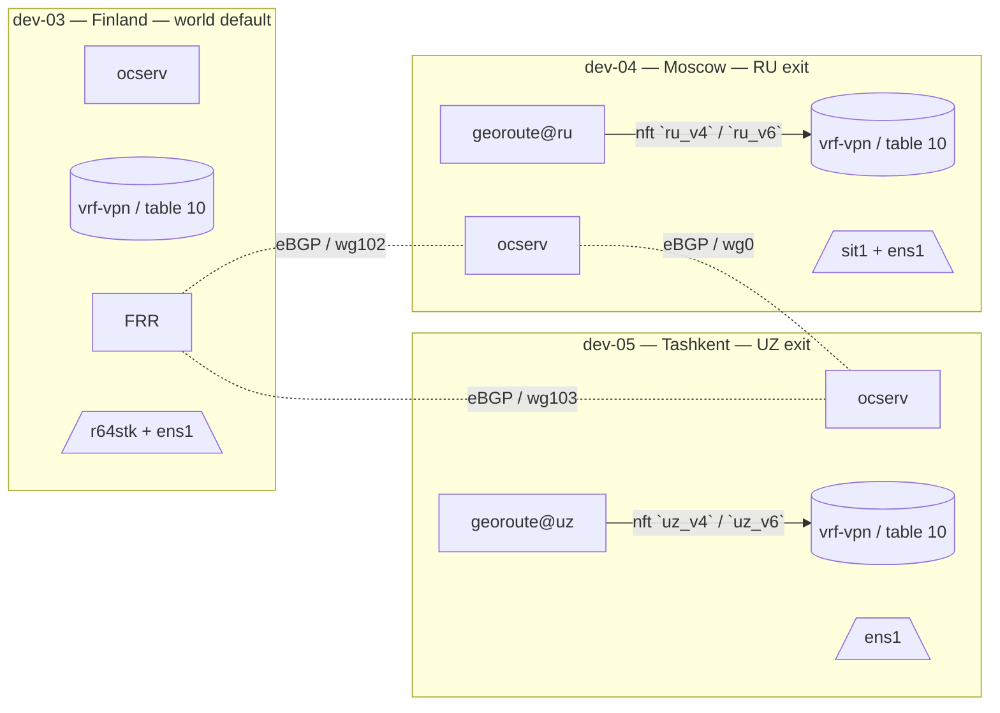

# 01 — Overview

## What this project ships

A reproducible Ansible configuration for an **OpenConnect VPN exit fleet** with per-country geographical routing.

Concrete components per host:

| Component                  | Role on the host                                                                    |
|----------------------------|-------------------------------------------------------------------------------------|
| `ocserv`                   | OpenConnect SSL VPN server (CSTP/DTLS)                                              |
| `vrf-vpn` (Linux VRF)      | Isolates VPN client routes from the host's own FIB                                  |
| `nftables`                 | Cross-VRF DNAT, MSS clamp, country-prefix marking                                   |
| `firewalld`                | Zone management on top of the same `nftables` ruleset                               |
| `FRR` (`bgpd`)             | eBGP with sibling exit nodes; announces country prefixes and learns siblings        |
| `WireGuard`                | Inter-site transit between exit nodes (one `wg*` per sibling)                       |
| `Pi-hole` + `dnscrypt-proxy` (optional) | Filtered DNS over DoH for VPN clients                                  |
| `georoute` (Go binary)     | Pulls country IP feeds from RIPE Stat → populates `nft pbr` sets + FRR `network` lines |

## What problem it solves

A user connecting to one of these exit nodes from any country sees:

| User-visible behavior                                                | Mechanism                                                                         |
|----------------------------------------------------------------------|-----------------------------------------------------------------------------------|
| Destination IP in country `XX` → traffic exits a node located in `XX`| `nft` marks dst-in-`xx_v4`/`xx_v6` → ip rule → PBR table → local uplink           |
| Destination IP not in any country list                               | Falls to VRF default route → world-default node (e.g. Finland) via WireGuard      |
| DNS queries                                                          | Pushed through the same VPN tunnel; optionally to a local Pi-hole service-IP     |
| Filtering of ads / trackers                                          | Pi-hole on the exit node, no client-side configuration                            |

## Fleet topology (current generation)



## Repository layout

```text
.
├── README.md                  # quickstart
├── ansible.cfg
├── inventory/
│   ├── hosts.yml
│   ├── group_vars/{all,vault}.yml
│   └── host_vars/dev-NN.yml
├── playbooks/
│   ├── site.yml               # full fleet apply
│   └── manage-user.yml        # ocpasswd add/del/list
├── roles/
│   ├── common/                # base packages + sysctls
│   ├── vrf-vpn/               # Linux VRF + table-10 routes + ip rules
│   ├── nft-vpn/               # cross-VRF DNAT + MSS clamp
│   ├── secure-dns/            # Pi-hole + dnscrypt + IPv6 socat
│   ├── ocserv/                # ocserv.conf + connect-vrf.sh
│   └── georoute/              # binary + pbr.nft + systemd timer
├── bin/
│   └── vpn-user               # wrapper around manage-user.yml
└── docs/
    ├── README.md
    ├── en/
    └── ru/
```

## Reading order

1. [Architecture](02-architecture.md) — data and control plane diagrams.
2. [Environment](03-environment.md) — what OS, kernel, packages, and why.
3. [Inventory](04-inventory.md) — how to model a new host.
4. [Deployment](06-deployment.md) — first apply.
5. [Adding a country exit](07-country-exit-bootstrap.md) — production bring-up.

Skip ahead via the [central README](../README.md).
