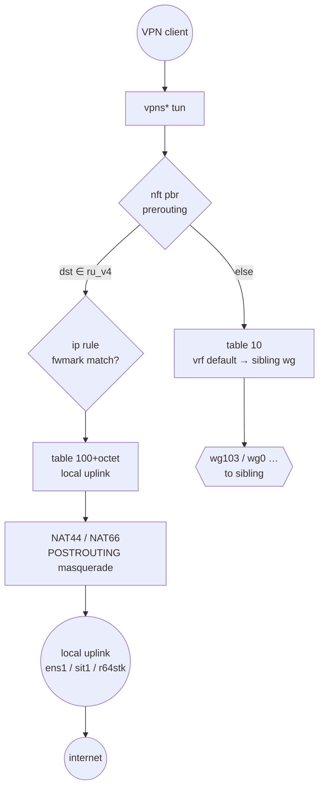
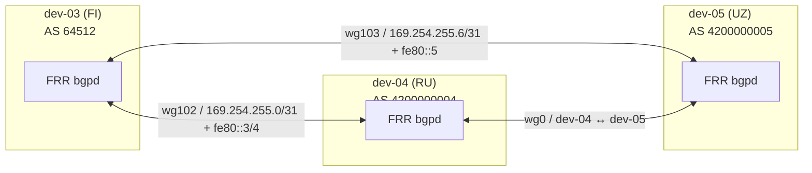
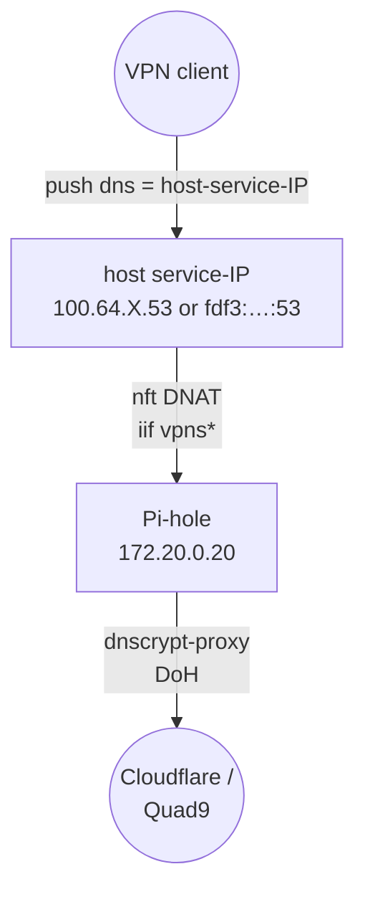

# 02 — Architecture

## Layers

| Layer            | What lives there                                                                    |
|------------------|-------------------------------------------------------------------------------------|
| User VPN client  | OpenConnect / AnyConnect / `openconnect` CLI; one CSTP+DTLS session                 |
| Data plane       | `vpns*` tun + `vrf-vpn` (table 10) + `nft pbr` + per-country PBR table + uplinks    |
| Control plane    | FRR `bgpd` over WireGuard; `georoute` feed updater; Ansible apply path              |
| Out-of-band      | SSH to `root@<host>`; `gh` CLI for documentation pushes                             |

## VRF isolation

Every per-client tunnel `vpns*` is enslaved into the master VRF `vrf-vpn` (table 10) by `connect-vrf.sh` (ocserv `connect-script` hook).

Properties:

- VPN client traffic never consults the host's main FIB (cannot reach internal infra).
- Replies for VPN-pool destinations enter the VRF via two **return routes** installed in the default-VRF `main` table:
  - IPv4: `100.64.<octet>.0/24 dev vrf-vpn`
  - IPv6: `fdf3:bb42:9fc6:<octet>::/64 dev vrf-vpn`
- Cross-VRF egress to the sibling site uses a regular `dev wg<X>` route in `table 10` — Linux forwards through the device even though `wg*` is in the default VRF.

Reference: [Linux VRF docs](https://docs.kernel.org/networking/vrf.html), [VRF and policy routing in Linux](https://lwn.net/Articles/658471/).

## Country geo-routing

Two complementary mechanisms:

1. **BGP** — every country-exit host announces its country prefixes (with community `64512:2<ISO-numeric>`) via WireGuard-eBGP. Siblings install them in `table 10` so VPN clients connected to a sibling reach the country through the WireGuard transit.
2. **PBR (Policy-Based Routing)** — on the country-exit host itself, `nft pbr prerouting` sets `meta mark` when destination ∈ `<cc>_v4`/`<cc>_v6`; `ip rule fwmark <X> lookup <N>` then sends the packet to a per-country routing table that points at the **local** uplink.



## Reply path — the subtle part

For traffic that is **NAT-masqueraded** locally (country-exit case), the conntrack-reverse-NAT'd reply has `src = <local public IP>` and `dst = <foreign VPN-client pool>`. Without an explicit static route for the foreign pool in the host's `main` table, the reply falls to `default` and exits the WAN again — black-hole.

Fix shipped here:

```bash
# On dev-04, for replies bound to dev-03's VPN clients:
ip -4 route add 100.64.3.0/24 via 169.254.255.0 dev wg0
ip -6 route add fdf3:bb42:9fc6:3::/64 via fe80::3 dev wg0
```

These are written by [`roles/vrf-vpn/templates/vrf-vpn.service.j2`](../../roles/vrf-vpn/templates/vrf-vpn.service.j2) using the `sibling_v4_pool` / `sibling_v6_pool` host vars.

## BGP control plane



- **Full eBGP mesh** (no route reflector) — cost is trivial at N≤5 hosts.
- **Per-route community** — every announced country prefix carries `64512:2<ISO-numeric>` (e.g. `64512:2643` for RU, `64512:2860` for UZ).
- **Route-maps** — `MARK-<CC>-EXIT` sets local-preference 300 on the origin (so the country exit always wins for its own prefixes); `FROM-PEER` matches on the community and sets local-preference 200 for VPN traffic.
- **Main-FIB filter** — `route-map BGP-MAIN-FIB deny match community CL-RU-EXIT` keeps country-tagged prefixes out of the host's own FIB (they only live in `vrf-vpn` table 10).

## Failure modes — fail-open to world default

When a country exit host goes down, BGP withdraws its prefixes. Traffic to that country then falls to `default` in `vrf-vpn` table 10 → sibling WireGuard → world-default host → its own uplink. Degraded geography, but connectivity is preserved.

For hard fail-closed behavior, add `country.fail_closed: true` to the host vars and the FRR template installs a blackhole for the country aggregate.

## Cross-cutting: DNS



The `secure-dns` role is opt-in (`secure_dns_enabled: true`). Hosts without it push public resolvers directly. The cross-VRF DNS path requires two unusual hooks:

1. Explicit `nft DNAT` at `priority -101` (before netavark's `-100`) because netavark gates on `fib daddr type local` which is false from `vrf-vpn`'s perspective.
2. `ip -6 rule iif vpns+ to <v6 service-IP> lookup main pref 900` so kernel ICMPv6 / socat replies escape the VRF.

See [`roles/nft-vpn/templates/vpn_dnat.nft.j2`](../../roles/nft-vpn/templates/vpn_dnat.nft.j2) for the v4 DNAT and [`roles/vrf-vpn/templates/vrf-vpn.service.j2`](../../roles/vrf-vpn/templates/vrf-vpn.service.j2) for the v6 rule.

## Routing-table layout

| Table   | Purpose                                                              | Selected by                                  |
|---------|----------------------------------------------------------------------|----------------------------------------------|
| `local` | Locally-bound addresses                                              | implicit                                     |
| `main`  | Host's own routing — `default via <real-uplink>` + return-route stubs | `ip rule pref 32766`                         |
| 10      | `vrf-vpn` — all VPN-client routing decisions                         | l3mdev rule (`pref 1000`) when iif=vpns*     |
| 50      | Self-PBR — host outbound bound to its own external IP                | `ip rule from <public-IP> lookup 50 pref 50` |
| 100+oct | Per-country local-exit table (e.g. RU=100, UZ=105)                   | `ip rule fwmark <country.fwmark> pref 100`   |

Octet-keyed numbering means the dev-NN's site_octet determines fwmark and table number: `fwmark = 0x200 | octet`, `table = 100 + octet`.

## What lives where on disk

```text
/etc/ocserv/
    ocserv.conf                     # generated by roles/ocserv
    connect-vrf.sh                  # connect-script hook
    ocpasswd                        # not managed by Ansible (per-host secret)
/etc/systemd/system/
    vrf-vpn.service                 # roles/vrf-vpn
    infra-loopback.service          # roles/vrf-vpn
    nft-pbr.service                 # roles/georoute
    nft-mss-clamp.service           # roles/nft-vpn
    nft-vpn-dnat.service            # roles/nft-vpn — only if secure_dns_enabled
    dns-v6-proxy.service            # roles/secure-dns — only if secure_dns_enabled
    dns-v6-proxy-tcp.service        # roles/secure-dns — only if secure_dns_enabled
    georoute@.service               # roles/georoute
    georoute@.timer                 # roles/georoute
/etc/nft.d/
    pbr.nft                         # roles/georoute — country prefix sets + mark chains
    mss_clamp.nft                   # roles/nft-vpn — wg* MSS clamp
    vpn_dnat.nft                    # roles/nft-vpn — cross-VRF DNS DNAT (if secure-dns)
/etc/georoute/
    <cc>.env                        # roles/georoute — env file for each country owned
/etc/frr/
    frr.conf                        # NOT yet Ansible-managed — manual for now
/etc/sysctl.d/
    91-router.conf                  # roles/common
/usr/local/bin/
    georoute                        # roles/georoute — compiled Go binary
```

## Where to read next

- [Environment](03-environment.md) — what OS, kernel, packages.
- [Inventory](04-inventory.md) — host vars in depth.
- [Roles](05-roles.md) — one section per Ansible role.
