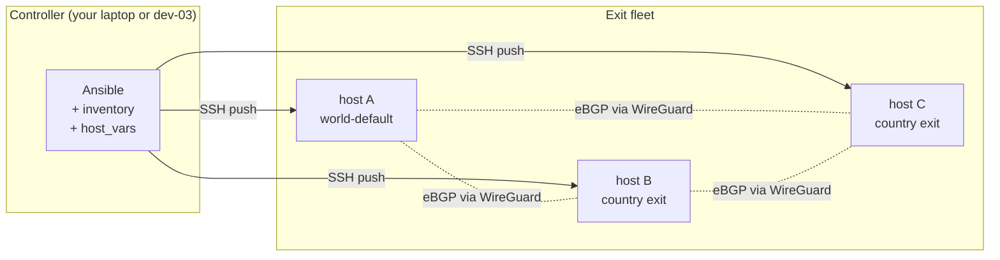
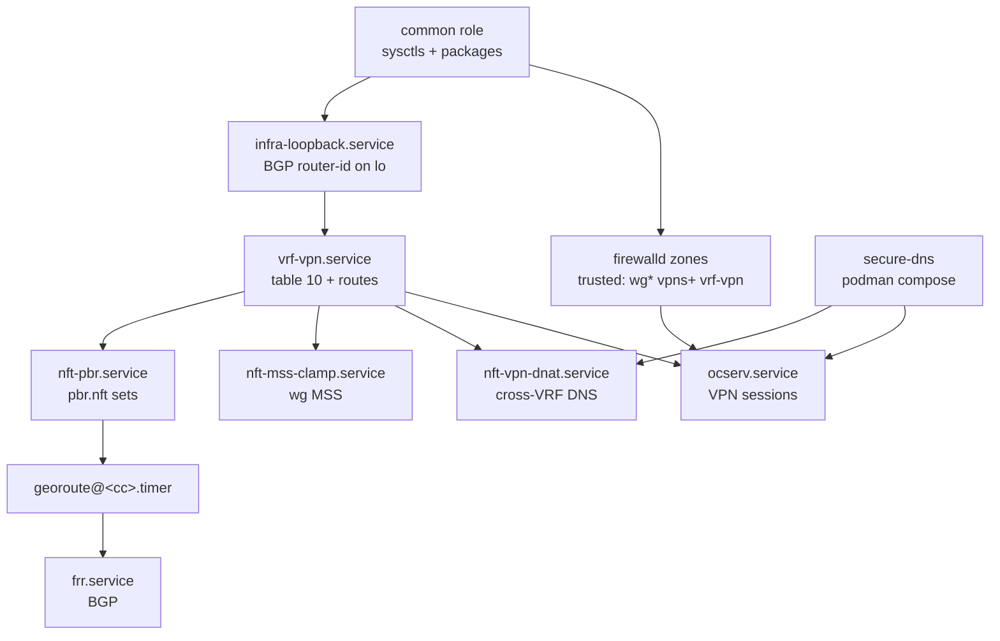

# 00 — Как всё это работает вместе

Самодостаточный обзор, связывающий все компоненты между собой и показывающий
реальные файлы, которые правишь, чтобы всё заработало. Прочитай это
**до** разделовых документов.

## Суть за 60 секунд

Запускаешь **N хостов** в разных странах. Один из них — exit "world-default".
Остальные владеют трафиком одной страны каждый. VPN-клиент подключается
к любому из них и получает:

- назначения в стране `XX` → выход через хост, **физически расположенный
  в `XX`**;
- всё остальное → выход через хост world-default.

Если страновой хост падает, трафик этой страны откатывается на
хост world-default. Конфигурацию клиента менять не требуется.

Репозиторий разворачивает это **только через Ansible**. После первого запуска
`ansible-playbook` ручной SSH на хосты не требуется.

## Что где находится — с высоты птичьего полёта



Три слоя, каждый управляется своим компонентом:

| Слой             | Владелец       | Что делает                                                     | Конфиг, который правишь             |
|------------------|----------------|----------------------------------------------------------------|-------------------------------------|
| Data plane       | ядро Linux     | фактически форвардит пакеты                                    | нет — управляется двумя другими     |
| Control plane    | FRR + georoute | сообщает ядру, какое назначение куда идёт                      | блок `country:` в `host_vars/dev-NN.yml` + ручные соседи в `frr.conf` |
| Configuration    | Ansible        | рендерит шаблоны, перезапускает сервисы, перезагружает `occtl` | `inventory/`, `playbooks/site.yml`  |

## Разбор на примере — RU exit + FI world default

Два физических хоста. Пример использует **RFC 5737** (`192.0.2.0/24`,
`198.51.100.0/24`) для IPv4 и **RFC 3849** (`2001:db8::/32`) для IPv6 — замени
на реальные адреса своего провайдера.

### 1. Распределение идентификаторов

| | host A (dev-03) | host B (dev-04) |
|---|---|---|
| Роль            | world-default exit (Финляндия)      | country-exit (Россия)               |
| Public v4       | `192.0.2.3`                         | `198.51.100.4`                      |
| Public v6       | `2001:db8:fi::2`                    | `2001:db8:ru::2`                    |
| `site_octet`    | `3`                                 | `4`                                 |
| Private ASN     | `64512` (legacy)                    | `4200000004`                        |
| VPN v4 pool     | `100.64.3.0/24` (CGNAT)             | `100.64.4.0/24`                     |
| VPN v6 pool     | `fdf3:bb42:9fc6:3::/64` (ULA)       | `fdf3:bb42:9fc6:4::/64`             |
| BGP router-id   | `10.255.0.3`                        | `10.255.0.4`                        |
| Имя WG-iface    | `wg102`                             | `wg0`                               |
| WG /31 link     | `169.254.255.0` ↔ `169.254.255.1`   | то же                               |
| Тег страны      | (нет — это exit по умолчанию)       | `64512:201` (legacy RU community)   |
| `fwmark`        | (нет)                               | `0x201`                             |
| PBR-таблица     | (нет)                               | `100`                               |

### 2. Inventory: два файла

`inventory/hosts.yml`:

```yaml
all:
  children:
    exits:
      children:
        exits-world:
          hosts:
            dev-03:
              ansible_host: 192.0.2.3
              ansible_connection: local        # if you run Ansible on dev-03
        exits-country-local:
          hosts:
            dev-04:
              ansible_host: 198.51.100.4
              ansible_connection: ssh
```

`inventory/host_vars/dev-03.yml` (хост world-default):

```yaml
site: fi
role: world-default
site_octet: 3
public_v4: 192.0.2.3
public_v6: "2001:db8:fi::2"

# Host uplinks (the actual NIC and gateway from `ip route`)
host_v4_uplink: ens1
host_v4_gw: 192.0.2.1
host_v6_uplink: r64stk         # whatever your v6 uplink is

# VPN clients on this host exit through host's own uplinks
v4_uplink_iface: ens1
v4_uplink_gw: 192.0.2.1
v6_uplink_iface: r64stk
v6_uplink_gw: "2001:db8:fi::1"

# Sibling site for transit-return routes
wg_sibling_iface: wg102                # name of WG iface to dev-04
sibling_v4_pool: 100.64.4.0/24
sibling_v6_pool: "fdf3:bb42:9fc6:4::/64"
wg_sibling_peer_v4: 169.254.255.1      # dev-04 side of the /31
wg_sibling_peer_v6: "fe80::4"

# Pools, BGP, ocserv vhosts (see 04-inventory.md for the full shape)
v4_pool_cidr: 100.64.3.0/24
v6_pool_cidr: "fdf3:bb42:9fc6:3::/64"
bgp_router_id_v4: 10.255.0.3
push_dns_resolvers: ["9.9.9.9", "2606:4700:4700::1111"]
secure_dns_enabled: false
ocserv_vhosts:
  - { name: vpn.example.org, is_default: true, user_profile: default.xml }
```

`inventory/host_vars/dev-04.yml` (RU country-exit):

```yaml
site: ru
role: country-exit
site_octet: 4
public_v4: 198.51.100.4
public_v6: "2001:db8:ru::2"

host_v4_uplink: ens1
host_v4_gw: 198.51.100.1
host_v6_uplink: sit1

# VPN clients on dev-04 exit through wg0 → dev-03 → FI uplink
# (only RU prefixes are overridden by georoute below to exit locally)
v4_uplink_iface: wg0
v4_uplink_gw: 169.254.255.0
v6_uplink_iface: wg0
v6_uplink_gw: "fe80::3"
wg_sibling_iface: wg0
sibling_v4_pool: 100.64.3.0/24
sibling_v6_pool: "fdf3:bb42:9fc6:3::/64"
wg_sibling_peer_v4: 169.254.255.0
wg_sibling_peer_v6: "fe80::3"

v4_pool_cidr: 100.64.4.0/24
v6_pool_cidr: "fdf3:bb42:9fc6:4::/64"
bgp_router_id_v4: 10.255.0.4
push_dns_resolvers: ["9.9.9.9", "2606:4700:4700::1111"]
secure_dns_enabled: false

# ☆ The country block — this is what makes dev-04 a country exit
country:
  iso2: RU
  iso_numeric: 643
  bgp_community: "64512:201"
  route_map: MARK-RU-EXIT
  nft_set_prefix: ru
  feed_url: "https://stat.ripe.net/data/country-resource-list/data.json?resource=RU&v4_format=prefix"
  fwmark: "0x201"
  pbr_table: 100
```

### 3. Туннель WireGuard — создаётся вручную один раз

WireGuard между dev-03 и dev-04 пока не шаблонизирован; создай его
вне Ansible:

```bash
# both hosts:
dnf install -y wireguard-tools
umask 077
wg genkey | tee /etc/wireguard/${IFACE}.key | wg pubkey > /etc/wireguard/${IFACE}.pub
wg genpsk > /etc/wireguard/${IFACE}.psk
```

dev-03 → `/etc/wireguard/wg102.conf`:

```ini
[Interface]
Address = 169.254.255.0/31
Address = fdf3:bb42:9fc6:ffff::2/127
PrivateKey = <dev-03 private key>
ListenPort = 31518
Table = off

[Peer]
PublicKey = <dev-04 public key>
PresharedKey = <shared psk>
AllowedIPs = 0.0.0.0/0, ::/0
Endpoint = 198.51.100.4:31518
PersistentKeepalive = 25
```

dev-04 → `/etc/wireguard/wg0.conf` — зеркальная копия с адресами
`169.254.255.1/31` + `fdf3:bb42:9fc6:ffff::3/127`, `Endpoint =
192.0.2.3:31518` и противоположными `PublicKey`/`PresharedKey`.

Подними оба:

```bash
systemctl enable --now wg-quick@wg102          # on dev-03
systemctl enable --now wg-quick@wg0            # on dev-04
ping -c2 169.254.255.1                          # from dev-03 — must succeed
```

### 4. FRR — секции neighbor (вручную один раз, роль в планах)

В `/etc/frr/frr.conf` на dev-03, внутри `router bgp 64512`:

```text
 neighbor 169.254.255.1 remote-as 4200000004
 neighbor 169.254.255.1 description dev-04-ru
 !
 address-family ipv4 unicast
  network 100.64.3.0/24
  network 10.255.0.3/32
  ! BEGIN-RU-FEED-V4
  ! END-RU-FEED-V4
  neighbor 169.254.255.1 activate
  neighbor 169.254.255.1 route-map FROM-DEV-04 in
  neighbor 169.254.255.1 route-map TO-DEV-04 out
 exit-address-family
 !
 address-family ipv6 unicast
  network fdf3:bb42:9fc6:3::/64
  ! BEGIN-RU-FEED-V6
  ! END-RU-FEED-V6
  neighbor fe80::4%wg102 activate
 exit-address-family

bgp community-list standard CL-RU-EXIT seq 5 permit 64512:201
route-map MARK-RU-EXIT permit 10
 set community 64512:201 additive
route-map BGP-MAIN-FIB deny 10
 match community CL-RU-EXIT
route-map BGP-MAIN-FIB permit 999

ip protocol bgp route-map BGP-MAIN-FIB
ipv6 protocol bgp route-map BGP-MAIN-FIB
```

`frr.conf` на dev-04 — зеркальный: `router bgp 4200000004`, neighbor
`169.254.255.0 remote-as 64512`, та же community + route-maps. Маркеры
`BEGIN-/END-RU-FEED-V4/V6` остаются пустыми, пока `georoute` не заполнит
их при первом запуске.

### 5. Применение Ansible

```bash
cd /path/to/polyexit
ansible-playbook playbooks/site.yml --check --diff   # dry-run
ansible-playbook playbooks/site.yml                   # apply
```

Playbook выполнит:

| Роль         | dev-03                                 | dev-04                                 |
|--------------|----------------------------------------|----------------------------------------|
| `common`     | sysctls + пакеты                       | sysctls + пакеты                       |
| `vrf-vpn`    | `vrf-vpn` table 10 с FI-дефолтами      | `vrf-vpn` table 10 с дефолтами wg0     |
| `nft-vpn`    | MSS clamp на `wg102`                   | MSS clamp на `wg0`                     |
| `ocserv`     | рендер `ocserv.conf` + connect-script  | то же                                  |
| `georoute`   | (пропущена — нет блока `country:`)     | установка бинарника + `/etc/georoute/ru.env` + запуск `georoute@ru.timer` |

### 6. Первая загрузка страновых префиксов

Таймер выстрелит через 5 минут после загрузки, но запусти его сейчас:

```bash
ssh root@198.51.100.4 systemctl start georoute@ru.service
ssh root@198.51.100.4 journalctl -u georoute@ru.service -n 8 --no-pager
# … georoute[RU] nft sets updated (ru_v4=8621 ru_v6=2186)
# … georoute[RU] frr-reload completed
```

dev-03 узнаёт RU-префиксы через BGP в течение секунд:

```bash
ssh root@192.0.2.3 vtysh -c 'show bgp ipv4 unicast community 64512:201 | head'
ssh root@192.0.2.3 ip -4 route show table 10 proto bgp | head
```

### 7. Проверка с реального VPN-клиента

Подключись к опубликованному vhost (`vpn.example.org`). С клиента:

```bash
curl -4 ifconfig.io                              # → 192.0.2.3 (FI exit)
curl -4 -H 'Host: ifconfig.io' 77.88.55.88       # ya.ru IP — exits Moscow
curl -6 ifconfig.io                              # → host's v6
```

IP назначения определяет exit автоматически.

## Файлы, которые ты правишь — шпаргалка

| Меняешь…                                          | …чтобы…                                             |
|---------------------------------------------------|-----------------------------------------------------|
| `inventory/hosts.yml`                             | добавить или убрать хост из флота                   |
| `inventory/host_vars/dev-NN.yml`                  | изменить per-host значения (uplink, pool, country)  |
| `inventory/group_vars/all.yml`                    | значения уровня флота (тюнинг ocserv, список пакетов) |
| `inventory/group_vars/vault.yml`                  | секреты (зашифровано через `ansible-vault`)         |
| `roles/<role>/templates/*.j2`                     | как рендерится конфигурационный файл                |
| `roles/<role>/tasks/main.yml`                     | что делает роль и в каком порядке                   |
| `playbooks/site.yml`                              | порядок ролей и условия                             |
| `/etc/frr/frr.conf` (вручную)                     | топологию BGP — см. [Добавление странового exit](07-country-exit-bootstrap.md) |
| `/etc/wireguard/<iface>.conf` (вручную)           | межсайтовые туннели                                 |

## Файлы, которые НИКОГДА не трогаешь руками

| Файл                                              | Почему                                              |
|---------------------------------------------------|-----------------------------------------------------|
| `/etc/systemd/system/vrf-vpn.service`             | рендерится `roles/vrf-vpn`                          |
| `/etc/ocserv/ocserv.conf`                         | рендерится `roles/ocserv`                           |
| `/etc/ocserv/connect-vrf.sh`                      | рендерится `roles/ocserv`                           |
| `/etc/nft.d/*.nft`                                | рендерится `roles/nft-vpn` и `roles/georoute`       |
| `/etc/georoute/<cc>.env`                          | рендерится `roles/georoute`                         |
| Содержимое `/etc/frr/frr.conf` **между** маркерами `BEGIN-<CC>-FEED-{V4,V6}` | пишется `georoute` при каждом срабатывании таймера |

Если меняешь один из этих файлов руками, следующий прогон playbook затрёт
твою правку. Правь шаблон.

## Схема зависимостей компонентов



## Минимум, чтобы попробовать это на одном ноутбуке

Флот не нужен. Чтобы прогнать part data-plane:

```bash
# A throwaway VM with OL10/Rocky10/Alma10/RHEL10:
dnf install -y ansible-core git
ansible-galaxy collection install ansible.posix community.general
git clone https://github.com/dantte-lp/polyexit.git
cd polyexit

# Make hosts.yml localhost-only:
cat > inventory/hosts.yml <<'YAML'
all:
  children:
    exits:
      children:
        exits-world:
          hosts:
            laptop:
              ansible_connection: local
YAML

# Minimum host_vars (drop secure_dns_enabled, no sibling)
cp inventory/host_vars/dev-03.yml inventory/host_vars/laptop.yml
$EDITOR inventory/host_vars/laptop.yml          # adjust your interface names

ansible-playbook playbooks/site.yml
```

Без BGP-пира, без WireGuard-соседа — только обвязка VRF + ocserv + nft
на одном хосте. Достаточно, чтобы проверить логику ролей перед переходом
на multi-site.

## Что читать дальше

- [Архитектура](02-architecture.md) — диаграммы и механика уровня ядра.
- [Inventory](04-inventory.md) — каждая переменная хоста подробно.
- [Добавление странового exit](07-country-exit-bootstrap.md) — production-grade чеклист.
- [Траблшутинг](10-troubleshooting.md) — когда один из слоёв ведёт себя не так.
