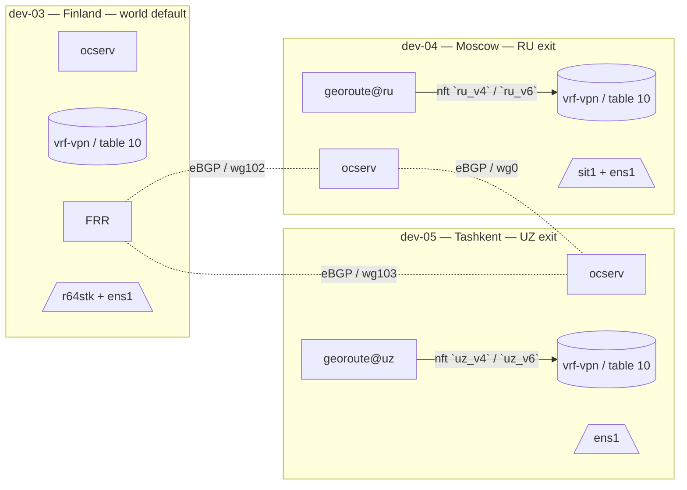

# 01 — Обзор

## Что поставляет этот проект

Воспроизводимая Ansible-конфигурация для **флота exit-узлов OpenConnect VPN** с гео-маршрутизацией по странам.

Конкретные компоненты на каждом узле:

| Компонент                  | Роль на узле                                                                        |
|----------------------------|-------------------------------------------------------------------------------------|
| `ocserv`                   | OpenConnect SSL VPN-сервер (CSTP/DTLS)                                              |
| `vrf-vpn` (Linux VRF)      | Изолирует маршруты VPN-клиентов от собственной FIB узла                             |
| `nftables`                 | Cross-VRF DNAT, MSS clamp, маркировка country-префиксов                             |
| `firewalld`                | Управление зонами поверх того же `nftables`-набора правил                           |
| `FRR` (`bgpd`)             | eBGP с соседними exit-узлами; анонсирует country-префиксы и принимает от соседей    |
| `WireGuard`                | Inter-site транзит между exit-узлами (один `wg*` на каждого соседа)                 |
| `Pi-hole` + `dnscrypt-proxy` (опционально) | Фильтрованный DNS через DoH для VPN-клиентов                        |
| `georoute` (Go-бинарь)     | Тянет страновые IP-фиды из RIPE Stat → наполняет `nft pbr` sets + FRR `network`-строки |

## Какую задачу это решает

Пользователь, подключившийся к одному из этих exit-узлов из любой страны, видит:

| Поведение, видимое пользователю                                      | Механизм                                                                          |
|----------------------------------------------------------------------|-----------------------------------------------------------------------------------|
| IP назначения в стране `XX` → трафик выходит через узел в `XX`       | `nft` маркирует dst-in-`xx_v4`/`xx_v6` → ip rule → PBR table → локальный uplink   |
| IP назначения не входит ни в один страновой список                   | Падает в default-маршрут VRF → world-default узел (например, Финляндия) через WireGuard |
| DNS-запросы                                                          | Прокачиваются через тот же VPN-туннель; опционально на локальный Pi-hole service-IP |
| Фильтрация рекламы / трекеров                                        | Pi-hole на exit-узле, без клиентской настройки                                    |

## Топология флота (текущее поколение)



## Структура репозитория

```text
.
├── README.md                  # quickstart
├── ansible.cfg
├── inventory/
│   ├── hosts.yml
│   ├── group_vars/{all,vault}.yml
│   └── host_vars/dev-NN.yml
├── playbooks/
│   ├── site.yml               # применение ко всему флоту
│   └── manage-user.yml        # ocpasswd add/del/list
├── roles/
│   ├── common/                # базовые пакеты + sysctls
│   ├── vrf-vpn/               # Linux VRF + маршруты table-10 + ip rules
│   ├── nft-vpn/               # cross-VRF DNAT + MSS clamp
│   ├── secure-dns/            # Pi-hole + dnscrypt + IPv6 socat
│   ├── ocserv/                # ocserv.conf + connect-vrf.sh
│   └── georoute/              # бинарь + pbr.nft + systemd timer
├── bin/
│   └── vpn-user               # обёртка вокруг manage-user.yml
└── docs/
    ├── README.md
    ├── en/
    └── ru/
```

## Порядок чтения

1. [Архитектура](02-architecture.md) — диаграммы data и control plane.
2. [Окружение](03-environment.md) — какая ОС, ядро, пакеты и почему.
3. [Инвентарь](04-inventory.md) — как смоделировать новый узел.
4. [Развёртывание](06-deployment.md) — первое применение.
5. [Добавление country exit](07-country-exit-bootstrap.md) — production-ввод в эксплуатацию.

Перейти быстрее через [центральный README](../README.md).
