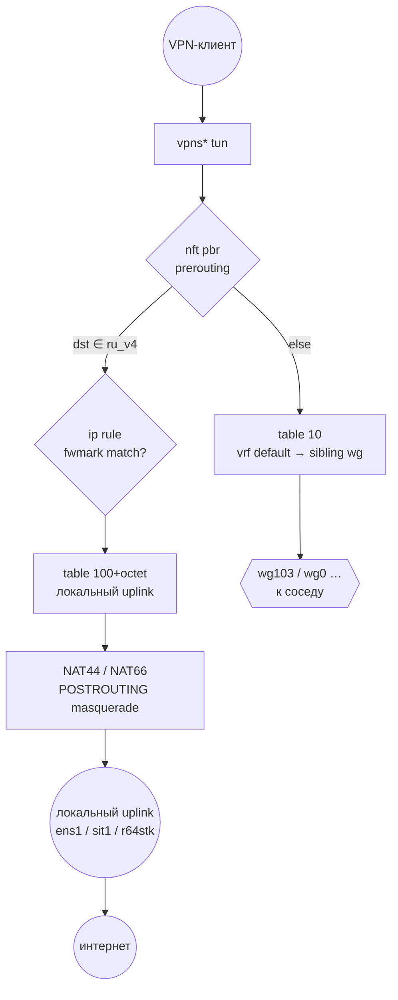
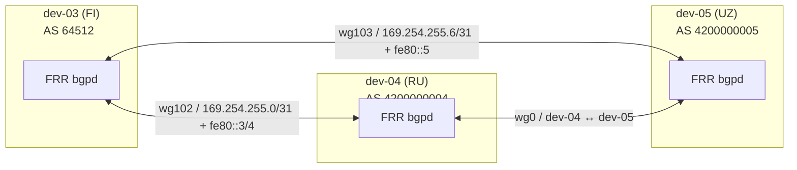
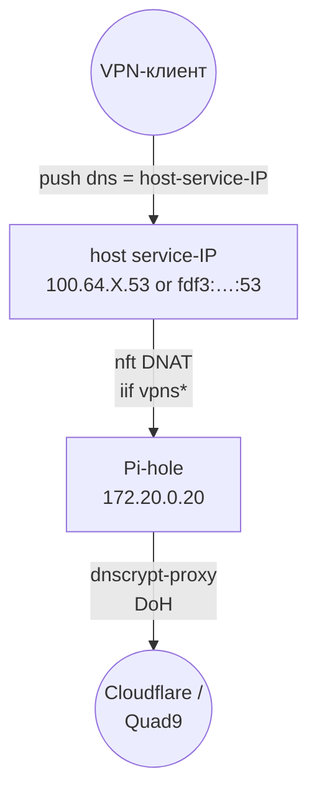

# 02 — Архитектура

## Слои

| Слой              | Что там живёт                                                                       |
|-------------------|-------------------------------------------------------------------------------------|
| VPN-клиент        | OpenConnect / AnyConnect / CLI `openconnect`; одна сессия CSTP+DTLS                 |
| Data plane        | `vpns*` tun + `vrf-vpn` (table 10) + `nft pbr` + per-country PBR table + uplinks    |
| Control plane     | FRR `bgpd` поверх WireGuard; обновлятор фидов `georoute`; путь применения Ansible   |
| Out-of-band       | SSH к `root@<host>`; CLI `gh` для пушей документации                                |

## Изоляция через VRF

Каждый клиентский туннель `vpns*` загоняется в master VRF `vrf-vpn` (table 10) через `connect-vrf.sh` (хук ocserv `connect-script`).

Свойства:

- Трафик VPN-клиента никогда не консультируется с основной FIB узла (не может достучаться до внутренней инфры).
- Ответы для адресов из VPN-пула попадают в VRF через два **return route**, установленные в таблице `main` default-VRF:
  - IPv4: `100.64.<octet>.0/24 dev vrf-vpn`
  - IPv6: `fdf3:bb42:9fc6:<octet>::/64 dev vrf-vpn`
- Cross-VRF egress в сторону соседнего сайта использует обычный маршрут `dev wg<X>` в `table 10` — Linux форвардит через устройство, даже если `wg*` находится в default-VRF.

Справка: [документация Linux VRF](https://docs.kernel.org/networking/vrf.html), [VRF и policy routing в Linux](https://lwn.net/Articles/658471/).

## Страновая гео-маршрутизация

Два взаимодополняющих механизма:

1. **BGP** — каждый country-exit узел анонсирует свои страновые префиксы (с community `64512:2<ISO-numeric>`) через WireGuard-eBGP. Соседи устанавливают их в `table 10`, чтобы VPN-клиенты, подключённые к соседу, доходили до страны через WireGuard-транзит.
2. **PBR (Policy-Based Routing)** — на самом country-exit узле `nft pbr prerouting` ставит `meta mark`, когда назначение ∈ `<cc>_v4`/`<cc>_v6`; `ip rule fwmark <X> lookup <N>` отправляет пакет в страновую routing table, указывающую на **локальный** uplink.



## Reply path — тонкий момент

Для трафика, который **NAT-маскарадится** локально (случай country-exit), conntrack-reverse-NAT'нутый ответ имеет `src = <локальный публичный IP>` и `dst = <чужой VPN-client pool>`. Без явного статического маршрута для чужого пула в таблице `main` узла ответ падает в `default` и снова уходит в WAN — чёрная дыра.

Фикс, который везут здесь:

```bash
# На dev-04, для ответов, адресованных VPN-клиентам dev-03:
ip -4 route add 100.64.3.0/24 via 169.254.255.0 dev wg0
ip -6 route add fdf3:bb42:9fc6:3::/64 via fe80::3 dev wg0
```

Эти маршруты пишет [`roles/vrf-vpn/templates/vrf-vpn.service.j2`](../../roles/vrf-vpn/templates/vrf-vpn.service.j2), используя host vars `sibling_v4_pool` / `sibling_v6_pool`.

## BGP control plane



- **Полный eBGP-меш** (без route reflector) — стоимость тривиальна при N≤5 узлах.
- **Community на каждом маршруте** — каждый анонсируемый страновой префикс несёт `64512:2<ISO-numeric>` (например, `64512:2643` для RU, `64512:2860` для UZ).
- **Route-maps** — `MARK-<CC>-EXIT` ставит local-preference 300 на источнике (так country exit всегда выигрывает для своих собственных префиксов); `FROM-PEER` матчит на community и ставит local-preference 200 для VPN-трафика.
- **Фильтр основной FIB** — `route-map BGP-MAIN-FIB deny match community CL-RU-EXIT` не пускает страновые префиксы в собственную FIB узла (они живут только в `vrf-vpn` table 10).

## Сценарии отказа — fail-open в world default

Когда country-exit узел падает, BGP отзывает его префиксы. Трафик в эту страну падает в `default` `vrf-vpn` table 10 → соседский WireGuard → world-default узел → его собственный uplink. Деградированная география, но связность сохраняется.

Для жёсткого fail-closed поведения добавь `country.fail_closed: true` в host vars, и FRR-шаблон установит blackhole для странового агрегата.

## Cross-cutting: DNS



Роль `secure-dns` opt-in (`secure_dns_enabled: true`). Узлы без неё пушат публичные резолверы напрямую. Cross-VRF DNS-путь требует двух необычных хуков:

1. Явный `nft DNAT` с `priority -101` (раньше netavark'овского `-100`), потому что netavark гейтит на `fib daddr type local`, что ложно с точки зрения `vrf-vpn`.
2. `ip -6 rule iif vpns+ to <v6 service-IP> lookup main pref 900`, чтобы ICMPv6/socat-ответы ядра вырывались из VRF.

Смотри [`roles/nft-vpn/templates/vpn_dnat.nft.j2`](../../roles/nft-vpn/templates/vpn_dnat.nft.j2) для v4 DNAT и [`roles/vrf-vpn/templates/vrf-vpn.service.j2`](../../roles/vrf-vpn/templates/vrf-vpn.service.j2) для v6-правила.

## Стек приоритетов nftables

Каждая базовая цепочка, цепляющаяся на одну и ту же точку netfilter, обязана иметь отличающийся priority — цепочки на одном hook с идентичным priority вычисляются в неопределённом порядке (согласно [nftables wiki — Configuring chains](https://wiki.nftables.org/wiki-nftables/index.php/Configuring_chains)). Флот использует явные числовые приоритеты, чтобы держать стек детерминированным и чтобы читателю было очевидно, на каком шаге пакет трогают.

| Hook | Priority | Table / chain                          | Задача                                            |
|------|----------|----------------------------------------|---------------------------------------------------|
| `prerouting` | -200 | (kernel raw/conntrack)             | conntrack lookup                                  |
| `prerouting` | -155 | `inet pbr / prerouting`            | ставит `meta mark`, когда dst ∈ `<cc>_v{4,6}`     |
| `prerouting` | -101 | `inet vpn_dnat / prerouting`        | DNAT DNS VPN-клиента в Pi-hole (если `secure_dns_enabled`) |
| `prerouting` | -100 | `inet netavark / prerouting`        | DNAT для container port-forward                   |
| `prerouting` |  +10 | `inet firewalld / nat_PRE`         | zone-aware destination NAT                        |
| `forward`    | -150 | `inet mss_clamp / forward`         | зажимает TCP MSS 1300/1240 на `wg_sibling_iface`  |
| `forward`    |  +10 | `inet firewalld / filter_FORWARD`  | zone-aware FORWARD-политика                       |
| `output`     | -150 | `inet pbr / output`                | помечает локально-сгенерированные пакеты (зеркало prerouting) |
| `postrouting`| +100 | `inet firewalld / nat_POST`        | zone-aware MASQUERADE / SNAT                      |

`pbr.prerouting` намеренно стреляет на `-155` (на один шаг раньше `mangle = -150`), чтобы mark был уже на месте, прежде чем какая-либо downstream-цепочка посмотрит на пакет. `mss_clamp` остаётся на каноническом `mangle = -150` на forward hook — никакая другая базовая цепочка во флоте не делит этот hook на этом priority, так что явное число — для документации и future-proofing.

`vpn_dnat` на `-101` стреляет на один тик раньше netavark'овского `-100`. Обе матчат по `iif`, но гейт netavark `fib daddr type local` ложен изнутри `vrf-vpn`, поэтому наш DNAT должен быть тем, кто ловит cross-VRF DNS-запрос.

Справка: [netfilter hooks and priorities](https://wiki.nftables.org/wiki-nftables/index.php/Netfilter_hooks).

## Раскладка routing-таблиц

| Таблица | Назначение                                                            | Выбирается                                   |
|---------|-----------------------------------------------------------------------|----------------------------------------------|
| `local` | Локально-привязанные адреса                                           | неявно                                       |
| `main`  | Собственная маршрутизация узла — `default via <real-uplink>` + return-route стабы | `ip rule pref 32766`                |
| 10      | `vrf-vpn` — все маршрутные решения VPN-клиентов                       | l3mdev rule (`pref 1000`), когда iif=vpns*   |
| 50      | Self-PBR — исходящий с узла, привязанный к его внешнему IP            | `ip rule from <public-IP> lookup 50 pref 50` |
| 100+oct | Страновая локальная exit-таблица (например, RU=100, UZ=105)           | `ip rule fwmark <country.fwmark> pref 100`   |

Octet-keyed нумерация означает, что site_octet dev-NN определяет fwmark и номер таблицы: `fwmark = 0x200 | octet`, `table = 100 + octet`.

## Что где живёт на диске

```text
/etc/ocserv/
    ocserv.conf                     # генерируется roles/ocserv
    connect-vrf.sh                  # хук connect-script
    ocpasswd                        # не управляется Ansible (per-host секрет)
/etc/systemd/system/
    vrf-vpn.service                 # roles/vrf-vpn
    infra-loopback.service          # roles/vrf-vpn
    nft-pbr.service                 # roles/georoute
    nft-mss-clamp.service           # roles/nft-vpn
    nft-vpn-dnat.service            # roles/nft-vpn — только если secure_dns_enabled
    dns-v6-proxy.service            # roles/secure-dns — только если secure_dns_enabled
    dns-v6-proxy-tcp.service        # roles/secure-dns — только если secure_dns_enabled
    georoute@.service               # roles/georoute
    georoute@.timer                 # roles/georoute
/etc/nft.d/
    pbr.nft                         # roles/georoute — country-префикс sets + mark-цепочки
    mss_clamp.nft                   # roles/nft-vpn — MSS clamp на wg*
    vpn_dnat.nft                    # roles/nft-vpn — cross-VRF DNS DNAT (если secure-dns)
/etc/georoute/
    <cc>.env                        # roles/georoute — env-файл для каждой страны узла
/etc/frr/
    frr.conf                        # ПОКА не управляется Ansible — пока вручную
/etc/sysctl.d/
    91-router.conf                  # roles/common
/usr/local/bin/
    georoute                        # roles/georoute — скомпилированный Go-бинарь
```

## Что читать дальше

- [Окружение](03-environment.md) — какая ОС, ядро, пакеты.
- [Инвентарь](04-inventory.md) — host vars в деталях.
- [Роли](05-roles.md) — по одной секции на Ansible-роль.
